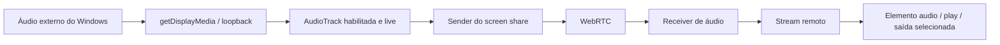

# Áudio de sistema e assistência nativa — 1.0.13

O fluxo existente de captura, WebRTC, consentimento, transporte e helper foi corrigido. Não foi criado outro serviço de controle ou outro overlay. O instalador inclui o frontend e o helper recompilados.

## O que a investigação comprovou

Antes de editar o fluxo nativo, um movimento enviado entre dois EXEs locais chegou ao Windows, posicionando o cursor em `(128, 265)` sem canvas. A captura anterior também tinha áudio e enviou/recebeu bytes e sinal decodificado no teste local. A ausência total relatada no EXE do usuário não foi reproduzida de forma idêntica neste computador. Sem a versão e os logs daquele ambiente, não atribuo sua falha a um único ponto não observado. Evidência anterior às alterações: [baseline-native.json](validation/baseline-native.json).

Os defeitos identificados no código eram concretos:

1. A captura desktop usava as constraints legadas de `getUserMedia` e fornecia o identificador de tela/janela também ao áudio. Qualquer falha na tentativa de áudio fazia o código continuar com `audio: false`. Isso podia deixar o host sem faixa de áudio, sem sender e sem seção de áudio da transmissão, enquanto o vídeo continuava funcionando.
2. Uma falha de `play()` aparecia somente no console. O viewer não recebia uma ação para liberar a reprodução. Quando áudio chegava depois do vídeo, reutilizar o mesmo `MediaStream` também podia impedir uma atualização do efeito de reprodução no React.
3. O cursor visual nasce em `CanvasInteractionTarget._renderOverlay()`. Sem a bridge desktop, o target é canvas: o caminho termina nele, sem IPC ou `SendInput`. Além disso, o modo mostrado ao viewer era inferido pela capacidade local do viewer, em vez do modo do host. Isso confundia apresentação com controle do Windows.
4. No caminho nativo, `NativeDesktopInteractionTarget` ignorava respostas `false` do IPC, e `sendNativeCommand()` devolvia o resultado de `stdin.write()`. Isso confirmava escrita no pipe, sem confirmar parsing ou aplicação pelo Windows. O receiver contava eventos aceitos sem separar confirmação nativa. O helper era iniciado sem esperar `READY` e os `OK` não eram correlacionados aos comandos.
5. Scroll horizontal era descartado na captura/target; scroll não reposicionava o cursor sobre a área correspondente antes do wheel. O tratamento de pointer capture podia interromper o envio de down em uma transição que invalidasse o pointer. Esses pontos foram corrigidos no fluxo existente.

## Captura e reprodução do áudio

O Electron instalado é **44.5.1**, com Chromium **152.0.7977.130**. A fonte escolhida no picker é validada no main process e reservada por 15 segundos para um único pedido da main frame. `setDisplayMediaRequestHandler()` autoriza o vídeo escolhido e o áudio Windows `loopback`; o renderer usa `getDisplayMedia()` com `restrictOwnAudio: true`. Há feature detection da API e da constraint. A captura confirma faixa habilitada/live e a configuração de exclusão; erros não são transformados silenciosamente em sucesso sem áudio. O picker também permite escolher explicitamente vídeo sem áudio.

Esse é o caminho específico documentado pelo [Electron para display media e loopback](https://www.electronjs.org/docs/latest/api/session#sessetdisplaymediarequesthandlerhandler-opts). A [correção de `restrictOwnAudio` do Electron](https://releases.electronjs.org/pr/52455) está incluída na série 44 usada pelo projeto. O runtime confirmou `deviceId: loopbackWithoutChrome`, `restrictOwnAudio: true`, estéreo e 48 kHz.

O áudio da chamada mantém seu `localStream` e seu PeerConnection. O áudio do sistema fica somente no stream/PeerConnection de screen share. Nenhuma faixa de microfone é adicionada à transmissão nem substituída por loopback. Opus é preferido via API de codecs, com detecção de suporte; não há alteração cega do SDP.

O viewer agrega faixas recebidas e atualiza o stream também quando áudio chega depois. Um único `<audio data-testid="remote-screen-audio">` reproduz o som da tela. O vídeo remoto e a prévia local ficam mutados, evitando duplicação e reprodução da própria transmissão. `play()`, volume, deafen e dispositivo de saída são tratados; se autoplay falhar, aparece uma ação para ativar o áudio. O diagnóstico expõe bytes/pacotes enviados e recebidos por mídia, além de codec e energia recebida. Encerramento da faixa de captura informa a perda do áudio.

## Controle do Windows e confirmação

O target nativo continua no mesmo caminho: eventos do viewer → `RealtimeTransport` → `InteractionEventReceiver` → `NativeDesktopInteractionTarget` → preload → IPC → `NativeInputHost` → Windows.

O helper precisa confirmar `READY`. Depois do consentimento nativo e do token emitido pelo servidor, a sessão é ativada no guard. Cada input revalida main frame, proprietário do IPC, sessão ativa, guest, token, monitor e sequência crescente. O receiver serializa a execução para preservar down/up e cancela comandos ainda em fila quando a autorização termina.

O pipe usa `SEQ <id> <comando>` e recebe `ACK <id> OK/ERR`. O retorno é associado à sequência do evento e somente um ACK bem-sucedido confirma aplicação. Movimentos incluem posição real lida com `GetCursorPos`. `SendInput` que falha registra `GetLastError()` no diagnóstico DEV. Texto e tokens não entram nos logs de input.

O host devolve confirmação ao viewer pelo mesmo DataChannel, ou pelo fallback autenticado existente. ACKs de movimentos são amostrados em 200 ms; ações discretas têm confirmação individual. O backend valida host, sessão, token e destinatário do ACK. O painel mostra sessão, transporte, IPC, helper, último input e último ACK; falhas e revogações preservam o diagnóstico.

Mouse suporta movimento, botões esquerdo/central/direito, duplo clique e drag como down/move/up. Wheel encaminha ambos os eixos e posiciona o cursor antes da rolagem. Teclas de controle/atalhos preservam down/up e scan codes; texto e composição PT-BR usam Unicode com eventos nativos de pressionamento/liberação. Blur/cancel, revogação, perda da conexão e EOF liberam inputs pressionados. O helper não ultrapassa UAC ou restrições de integridade do Windows.

O modo do viewer agora vem do host. Um host no navegador oferece **Interagir na apresentação**, identificado como sem controle do Windows. Um host no EXE Windows, compartilhando uma tela inteira, oferece controle nativo. Um viewer Web pode solicitar esse controle do host Desktop. Um Electron com bridge ausente não é convertido silenciosamente em target canvas.

## Provas executadas

**Teste A — transporte/canvas:** RTC e UI web verificam consentimento, transporte, revogação, voz, câmera, chat, transmissão, saída de áudio separada e recuperação após reinício do backend. Esse teste não comprova execução no Windows.

**Teste B — nativo:** dois EXEs empacotados, com perfis e contas independentes e backend/banco isolados. A captura de vídeo e áudio é real. Um processo Windows separado reproduz um WAV de 700 Hz. O viewer recebe o áudio por WebRTC e suas amostras decodificadas são inspecionadas. A saída HTML de áudio real é reproduzida brevemente, sem mute e com volume 1. Durante a medição prolongada ela é pausada para impedir realimentação: neste ensaio ambos os clientes compartilham o mesmo dispositivo físico de saída.

O viewer injeta eventos de teste na interface; a rede, o preload, IPC e `SendInput` são reais. O helper distribuído recebe `--target-window` somente por instrumentação do inspector do teste e fica restrito à janela pertencente ao teste. O consentimento React continua sendo percorrido; a resposta do diálogo nativo é substituída exclusivamente no processo de teste. Não há bypass de consentimento ou API genérica de Node adicionados ao produto.

No último ensaio do pacote final:

| Medição | Antes | Depois |
|---|---:|---:|
| Bytes de áudio enviados | 1.992 | 11.341 |
| Pacotes de áudio enviados | 36 | 201 |
| Bytes de áudio recebidos | 1.992 | 11.260 |
| Pacotes de áudio recebidos | 36 | 200 |
| RMS do áudio decodificado durante o tom externo | — | 0,0217626 |
| Posição desejada / aplicada pelo Windows | (128, 239) | (127, 240) |

A diferença de um pixel decorre do arredondamento do ponto CSS no viewer redimensionado. O helper leu a posição física aplicada. A faixa de sistema permaneceu habilitada durante mute do microfone. Um tom de 1 kHz reproduzido pelo próprio host não elevou sua componente na captura, confirmando exclusão do áudio do aplicativo. Clique, três botões, duplo clique, drag, scroll vertical/horizontal, texto `ação e coração 123`, navegação e Ctrl+A chegaram à janela real. O ACK da sequência 47 chegou ao viewer por DataChannel. Revogar liberou Ctrl e o botão pressionado; fechar o DataChannel liberou Shift e removeu a autorização. Voz e screen share continuaram após encerrar assistência. Evidência: [two-desktops.json](validation/two-desktops.json).

| FUNÇÃO | ANTES | DEPOIS | VALIDADO |
|---|---|---|---|
| Compartilhamento de vídeo | Funcionava | Preservado | Captura real e pacote final |
| Áudio do compartilhamento | Fallback podia retirar áudio; reprodução falhava sem ação visível | Loopback separado, exclusão do próprio app e recuperação de playback | Dois EXEs locais, RTP + PCM + player |
| Movimento de mouse | Canvas na Web; nativo sem confirmação de aplicação | Target nativo com posição física e ACK | Windows real, sem canvas |
| Clique | Sem ACK no pipeline | Botões esquerdo/central/direito, duplo clique e drag | Janela Windows real |
| Scroll | Eixo horizontal descartado; posição não encaminhada | Dois eixos e posição do frame | Rolagem real nos dois eixos |
| Teclado | Falha do IPC podia passar silenciosamente | Execução ordenada, Unicode, scan codes e ACK | Texto e teclas recebidos via SendInput |
| Revogação | Proteções existentes | Preservadas; fila cancelada e estado diagnosticável | Ctrl/Shift/botão liberados; DC fechado revoga |
| NativeInputHost | Pipe write era tratado como resultado | READY, ACK correlacionado, GetCursorPos e erro Win32 | Helper distribuído e input real |
| EXE | Build anterior | Instalador 1.0.13 e helper recompilado | ASAR, hashes, pacote executado e payload do instalador |

## Testes e limites

- `npm test`: **23 testes do cliente + 11 do backend/desktop = 34**, todos passaram.
- `npm run test:rtc`: mídia codificada bidirecional e DataChannel reais, target canvas/sintético.
- `npm run test:ui`: contas reais em banco isolado; configurações, voz, câmera, chat, DMs, screen share, áudio separado, consentimento canvas, reconexão e cleanup.
- `UI_TEST_HTTPS=true`, `UI_TEST_HOST=192.168.23.58`, `npm run test:ui`: mesma regressão pelo IP LAN com certificado confiável, sem desabilitar segurança.
- `npm run test:native`: SendInput em janela Windows pertencente ao teste; Unicode, mouse, drag, duplo clique, scroll, atalhos, navegação e liberação por EOF.
- `tests/desktop-smoke.js`: bridge, cofre criptografado, recusa padrão, rejeição de outra janela, notificações e badge.
- `npm run test:packaged:two-clients`: Teste B descrito acima, no pacote final.
- `node tests/packaged-smoke.js --capture-test --ui-test`: versão e preload do pacote, configurações, chamada, picker, prévia nativa, captura real 1920×1080/30 FPS e PING do helper.
- `scripts/verify-package.js`: compara todos os fontes desktop JS/CJS/C#, bundle frontend e helper com o ASAR/pasta unpacked.
- O payload real do NSIS foi extraído: `MeuApp.exe`, `app.asar` e `NativeInputHost.exe` são idênticos aos arquivos validados. Evidência: [installer-payload.json](validation/installer-payload.json).

Não houve ensaio entre dois computadores físicos, microfone físico, confirmação auditiva humana ou rede externa/NAT/TURN. O fluxo completo de input nativo foi testado por DataChannel; o fallback de eventos/ACK tem testes de transporte e autorização Socket.IO. O hardware disponível foi um monitor 1920×1080 em 100%; 125%, 150%, offsets negativos, monitores secundários e letterboxing foram verificados matematicamente, sem alterar o scaling físico do Windows. Falhas de `SendInput` por UIPI/UAC são reportadas, não contornadas. O build emite aviso de bundle maior que 500 kB. Erros de proxy nos testes de reconexão são esperados ao derrubar deliberadamente o backend.

## Arquivos alterados nesta correção

Captura e reprodução: `desktop/main.js`, `desktop/preload.cjs`, `client/src/context/VoiceContext.jsx`, `client/src/components/ScreenSourcePickerModal.jsx`, `VoiceRoom.jsx`, `MediaDiagnostics.jsx`, `client/src/rtc/ice.js`.

Assistência: `desktop/SessionGuard.js`, `desktop/NativeInputHost.cs`, `desktop/NativeInputHost.exe`, `client/src/context/InteractionContext.jsx`, `client/src/components/InteractionSurface.jsx`, `client/src/interaction/NativeDesktopInteractionTarget.js`, `InteractionEventReceiver.js`, `InteractionValidator.js`, `RealtimeTransport.js`, novo `diagnostics.js`, e `server/src/realtime.js`.

Versão e verificação: `package.json`, `package-lock.json`, `scripts/verify-package.js`; testes `ui-electron.js`, `native-electron.js`, `packaged-smoke.js`, `realtime.test.js`, novos `desktop-two-client.js`, `native-protocol.test.js` e `client/tests/native-ack.test.js`; este relatório e seus JSONs de evidência.

Não houve migração de banco nesta correção. Os testes usaram bases isoladas, preservando os dados existentes.

## Entrega local

Instalador: `C:\Users\geand\OneDrive\Documentos\Discord\dist\MeuApp-Setup-1.0.13.exe`.

Versão **1.0.13**. Build **05/10/2026 às 12:40:22 (America/Sao_Paulo)**, equivalente a `2026-10-05T15:40:22.482Z`.

SHA-256 do instalador: `1ea988641d0133bec6594c2d7d0d18a2f46ac303a0814e33aeb2d60b4b0b5ca2`.

Helper no pacote: `resources/app.asar.unpacked/desktop/NativeInputHost.exe`. SHA-256: `719b80660601b2548cc46fdd9563daf24dbbd30448add766956db1d01e9abd15`.

O backend atualizado também está em `dist/MeuApp-Backend-1.0.13.zip`, sem banco, uploads, dependências instaladas ou segredos. O encaminhamento dos novos ACKs pelo fallback requer esse código no servidor utilizado pelos clientes. Não houve implantação remota. Os builds locais usaram `electron-builder --win --publish never`.

Instale o novo EXE nos computadores que usarão o Desktop. Para controle nativo, o host compartilha uma tela inteira pelo EXE Windows; o viewer assiste, solicita assistência e o host autoriza. Para som do computador, mantenha a opção do picker habilitada. O host Web continua oferecendo apenas interação na apresentação, sem fingir controle do Windows.

Para suporte DEV, o painel **Diagnóstico** da assistência mostra sessão, transporte, IPC, helper e ACK. O log fica em `logs/app.log` dentro de `app.getPath('userData')`. Em desenvolvimento o trace é automático; no pacote pode ser habilitado com `MEUAPP_DIAGNOSTICS=true` no main process e `localStorage.setItem('meuapp_diagnostics','true')` no renderer. Ele registra etapas/tipos/sequências/resultados, sem texto digitado nem tokens.
