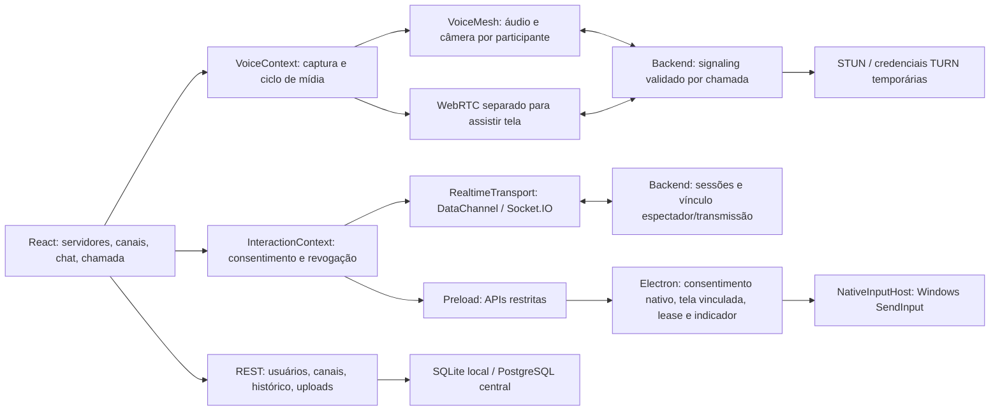

# Auditoria da experiência Discord + AnyDesk

Data: 5 de outubro de 2026. Escopo: cliente React compartilhado, Electron para Windows, backend REST/Socket.IO, SQLite/PostgreSQL, sinalização, coturn, empacotamento e testes. As alterações locais que já existiam em `desktop/main.js` e `NativeDesktopInteractionTarget.js` foram preservadas.

## Conclusão

A base já continha interface social, chat, captura de tela, um protocolo de interação e integração nativa com Windows. A voz e a câmera eram apenas locais; não havia receptor/transporte de mídia entre os participantes. A assistência não tinha autorização mantida pelo servidor nem vínculo obrigatório com uma transmissão. Os testes existentes verificavam sockets simulados e canvas; o nome “E2E” não demonstrava dois computadores, DataChannel aberto, áudio remoto ou execução nativa.

Foi evoluída a arquitetura existente para uma chamada com voz, câmera, tela, chat e assistência temporária no mesmo fluxo. Os testes locais agora exercitam RTP real e DataChannel real no Electron, além da interface React e do backend com SQLite isolado. Isso não constitui certificação de equivalência completa ao Discord/AnyDesk ou validação de produção.

## Mapa de arquitetura



Áudio/câmera permanecem conectados no provider quando o usuário abre um canal de texto. A transmissão pode continuar depois de encerrar somente a assistência. A assistência termina ao sair da chamada, parar de assistir/compartilhar, perder signaling ou perder sua conexão de dados. Nenhuma sessão de controle é retomada automaticamente.

A interação web já existente foi preservada como interação consentida no canvas da apresentação. A interface identifica essa capacidade; o navegador não é apresentado como controle nativo do computador. O mesmo ciclo de consentimento, transporte e revogação protege os dois tipos de alvo.

## Inventário e classificação

“Implementado” significa caminho no código. “Validado localmente” descreve somente o ambiente efetivamente testado. Recursos sem evidência externa permanecem explicitamente pendentes.

| Área | Situação encontrada | Resultado desta alteração / limite |
|---|---|---|
| Servidores e canais | REST, persistência, criação e interface existentes | Preservados; removida duplicação de servidor criado por REST + evento |
| Presença e membros | Estado global por socket, perfil local | Preservado; reconexão usa perfil atualizado. Identidade autenticada e membros por servidor continuam pendentes |
| Amigos e DMs | Botão inicial abre estado sem servidor; sem modelo/fluxo de amigos ou DMs | Ausentes; não apresentados como funcionalidades prontas |
| Chat | Envio e histórico existentes; histórico devolvia as 100 mensagens mais antigas; erro ao salvar ainda era transmitido como sucesso | Confirmação depois de persistir, últimas 100 mensagens, proteção contra resposta de canal antigo e deduplicação |
| Respostas | Ausentes | Migration aditiva `003_message_replies`, validação de canal, resposta no evento/histórico e UX de citação |
| Anexos | Upload existente; URL relativa quebrava no bundle `file:` do desktop | URL resolvida contra API; abertura de links HTTP(S) pelo navegador externo sem expor preload |
| Áudio | Captura local sem peers/receptores; detector retinha estados antigos e recursos | Transporte bidirecional, receptores persistentes, mute real, deafen silencia recepção e microfone, detector com limpeza |
| Dispositivos | Sem fluxo real de seleção | Listagem, troca de microfone com `replaceTrack`, saída com `setSinkId`; dispositivos físicos exigem teste manual |
| Câmera | Preview local e indicação remota sem vídeo | Envio e renderização remotos reais, validado com vídeo sintético |
| Tela | Captura e peers dedicados já existiam | Preservados; ICE antecipado em fila, listeners instalados antes do pedido, fonte selecionada, cancelamento e limpeza |
| Qualidade / tela cheia | Ausentes | Resolução/FPS via constraints, tela cheia do espectador; bitrate adaptativo avançado e 60 FPS pendentes |
| WebRTC | Sinalização de voz sem consumidor; riscos de disputa inicial e ICE antes do SDP | `VoiceMesh`, primeira oferta determinística, negociação e fila de ICE; RTP bidirecional local medido |
| TURN/STUN | Endpoint HMAC existente; DataChannel ignorava TURN; arquivo coturn com variáveis literais | Configuração ICE compartilhada, credenciais renovadas, coturn recebe argumentos expandidos, IP público obrigatório |
| Reconexão | Socket com perfil antigo; controle reconectava sem novo aceite | Socket atualiza presença; queda encerra chamada/controle, exige nova entrada e novo consentimento. Somente mídia pode reiniciar ICE |
| Consentimento | Tokens fracos no cliente, signaling sem registro de concessão | Token criptográfico do servidor, anfitrião vinculado, uma sessão por participante, pedido expira, aceite nativo adicional |
| DataChannel | Oferta antes de receptor pronto, envio duplicado pelo fallback, listeners/timer vazando | Handshake `interaction_ready`, `readyState === open`, fallback único, backpressure, limpeza completa, sem retomar concessão |
| Coordenadas | Aspecto 16:9 fixo, barras pretas acionavam borda, display inválido caía no principal | Aspecto do vídeo real, rejeição de barras, display vinculante, conversão DIP → coordenadas Windows, captura/liberação de ponteiro |
| Teclado / mouse | Validação permitia NaN/botões inválidos; teclas presas e newline no protocolo | Validação finita, sequência obrigatória, release em blur/revogação/EOF, proteção contra injeção de linha; layouts/dead keys pendentes |
| Electron/IPC | Isolation/sandbox existentes; autorização só por string e sem validação de remetente | IPC do frame principal, consentimento nativo, watchdog, indicador independente, Ctrl+Alt+Esc, bloqueio de navegação |
| UX integrada | Controle oferecido em qualquer participante, canvas fictício dizia conectado | Solicitar assistência somente ao anfitrião cuja tela está sendo assistida; chat lateral, participantes e encerramento na chamada |
| Performance | WebSocket duplicado, áudio não liberado, estado React atualizado por cada movimento | Movimento limitado, auditoria amostrada, buffers limitados, recursos fechados. Mesh tem custo crescente por participante |
| Logs/diagnóstico | Metadados rasos; qualquer par ICE sucedido podia ser chamado de TURN | Redação recursiva de segredos/input, rotação, diagnóstico por par selecionado, estado DataChannel separado de autorização |
| Distribuição | EXE nativo pré-compilado e arquivo dentro de ASAR | Compilação C# antes do build, `asarUnpack`, resolução do helper desempacotado. Não houve publicação/release |

## Consentimento e interrupção

1. Ambos entram na mesma chamada. O anfitrião compartilha uma **tela inteira** no Electron para Windows.
2. O convidado abre a transmissão e solicita assistência. Capturar uma janela continua funcionando; assistência sobre janelas não é habilitada porque o mapeamento nativo atual é por monitor.
3. O anfitrião aceita o pedido na aplicação e confirma a permissão no diálogo nativo. Não há concessão persistente, acesso automático ou modo não supervisionado.
4. O servidor cria um token temporário. O anfitrião instala o receptor, informa que está pronto e só então o convidado negocia a conexão.
5. O indicador nativo permanece visível inclusive ao abrir chat ou minimizar a janela principal. O botão do indicador, o botão na chamada e Ctrl+Alt+Esc revogam a sessão.
6. A revogação invalida token e receptor, encerra transporte e libera teclas/botões injetados. O transporte exige heartbeat autenticado do outro participante, com limite de 6,5 segundos e verificação a cada segundo. A lease nativa só é renovada quando esse peer está vivo. Um watchdog separado encerra a concessão se o renderer travar. Quedas detectadas são revogadas imediatamente; falhas silenciosas são limitadas por esses watchdogs.

O fallback Socket.IO é identificado como tal no diagnóstico. “Autorizado” não significa “DataChannel aberto”. Comandos não são enviados enquanto a conexão estiver apenas negociando. Eventos que ficaram em buffer não executam depois da revogação. Ao exceder limites de comandos, a assistência encerra para evitar liberar apenas parte de uma combinação de teclas.

## Validação reproduzível

```powershell
npm test
npm run build:client
npm run build:native
# Em ambientes que configuram Electron para agir como Node:
$env:ELECTRON_RUN_AS_NODE = $null
npm run test:rtc
npm run test:ui
```

- Os 10 testes originais passaram antes das mudanças; continuaram passando depois.
- `npm test`: protocolos, validação, fila de ICE, gaps de sequência, lifecycle, guard nativo e testes **com servidor Socket.IO real**. Verifica rejeição antes de compartilhar/assistir, consentimento falsificado, token incorreto, outro canal, revogação, novo token e desconexão.
- `test:rtc`: duas janelas Electron com PeerConnections reais, mídia sintética, bytes de RTP de áudio recebidos nos dois sentidos, frames de vídeo decodificados, DataChannel **OPEN**, cinco comandos entregues ao canvas e voz conectada após revogar. Passou três vezes seguidas depois da correção da disputa inicial.
- `test:ui`: aplicação React real, backend real, migrações/SQLite isolado e dois clientes. Verifica áudio recebido, câmera remota, vídeo de tela recebido, chat na chamada, respostas persistidas, consentimento visível, três comandos de ponteiro realmente recebidos pelo canvas, revogação preservando a transmissão, dispositivos, deafen e limpeza. Mídia sintética substitui captura física apenas nesse teste.
- Build Vite e compilação do helper C# executados. Os testes criam banco temporário; não substituem `data/discord.db`. Imagem da chamada em `docs/validation/call.png`.
- O helper compilado foi iniciado e respondeu a `PING`, depois encerrou com código zero, sem injetar entradas no computador.
- `electron-builder --win --dir` passou, com saída separada em `dist/desktop-audit/win-unpacked`. O helper fica em `resources/app.asar.unpacked/desktop/NativeInputHost.exe`. Esse pacote de verificação não configura um backend público; o instalador de produção continua dependendo de `VITE_API_URL` e validação em máquina limpa.
- Lint executado sem erros, com avisos de hooks/variáveis existentes e de callbacks que usam refs. Esses avisos permanecem para refatoração posterior; não foram tratados como evidência de fluxo funcionando.

O teste original `e2e_functional.test.js` continua sendo um teste funcional com hub simulado. Ele não deve ser citado como prova de controle entre computadores.

## Pendências materiais para produto completo

1. **Identidade e autorização social:** `AuthContext` é um perfil em localStorage, não login. As APIs de perfis/servidores/arquivos e presença ainda aceitam identidade declarada pelo cliente. Tabelas de papéis, membros e convites não têm autorização aplicada às rotas. O vínculo de consentimento agora é entre sockets reais, mas o nome apresentado não comprova a identidade da pessoa. Acesso de produção exige autenticação e permissões por servidor/canal, quotas e restrição de origem.
2. **Amigos, DMs e notificações desktop:** faltam persistência/fluxos; não foram inventadas telas que aparentam funcionar. Sons e presença existentes permanecem. Central de notificações, badge e mensagens privadas são trabalho de produto ainda necessário.
3. **Controle físico em dois PCs:** executar teste consentido em Windows com monitores secundários, escala 100/125/150%, offsets negativos, arraste, wheel, teclado PT-BR, minimização, travamento e fechamento. O teste automatizado usa alvo canvas; não certifica execução física. Janelas elevadas/UAC e telas seguras têm limites do Windows. Não há bypass de UAC.
4. **TURN em produção:** fornecer domínio, IPv4 público, segredo e firewall; executar teste com `VITE_FORCE_RELAY=true` e confirmar **par selecionado relay + bytes recebidos**, nas redes LAN, móvel, NAT restritivo e UDP bloqueado. Configuração no arquivo não demonstra uso. TURN/TLS em 443/5349 requer certificados e infraestrutura adicional; o Compose fornecido configura UDP/TCP em 3478.
5. **Estabilidade sob carga:** medir CPU, RAM, uplink, perda de pacotes e latência em chamadas longas/múltiplos espectadores. Não existe SFU; arquitetura mesh não tem escalabilidade equivalente ao Discord.
6. **Distribuição:** conferir instalador Windows em máquina limpa e backend público correto; certificar assinatura/atualizações. Não executar `npm run release` durante testes: ele faz commit, tag e push. Build de produção continua exigindo URL explícita.

A mudança de protocolo `interaction_ready` e os heartbeats exigem atualizar backend e clientes em conjunto. Não se deve publicar somente o desktop esperando compatibilidade com a sinalização antiga.

## Fontes técnicas conferidas

- [Especificação W3C WebRTC](https://www.w3.org/TR/webrtc/): negociação e dependência da descrição remota para ICE.
- [Segurança IPC do Electron](https://github.com/electron/electron/blob/main/docs/tutorial/security.md): validação do frame remetente.
- [API screen do Electron](https://www.electronjs.org/docs/latest/api/screen): coordenadas DIP/Windows.
- [Imagem oficial coturn](https://github.com/coturn/coturn/blob/master/docker/coturn/README.md): configuração por argumentos e mapeamento do IP externo.
